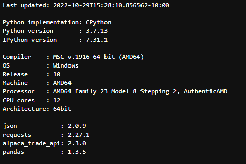
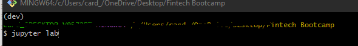
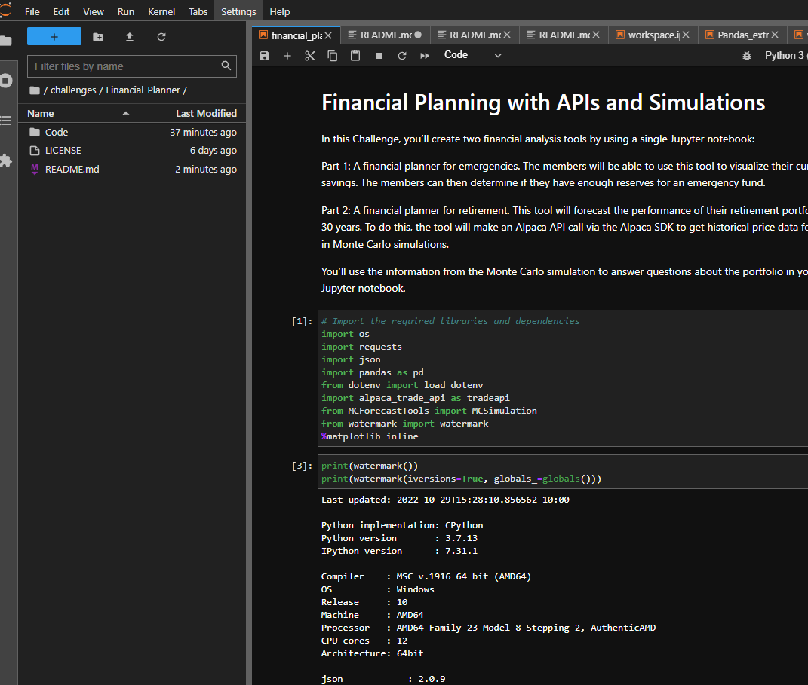
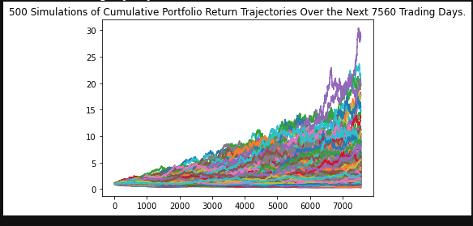
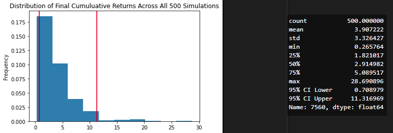
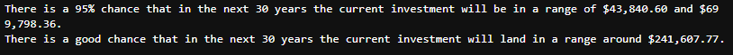
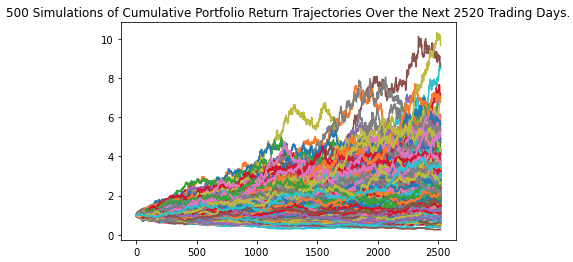
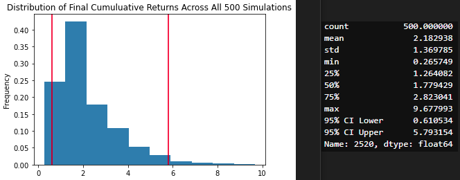
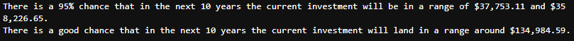

# Financial Planner using pandas and Monte Carlo simulations

Challenge 5 for fintech bootcamp through UC Berkeley. Using pandas and Monte Carlo(MC) simulations to help analyze a portfolio and predict its future return in 'x' amount of years, as well as adjusting for the optimal weight among assets in the portfolio.

This python notebook `financial_planning_tools.ipynb` located in the 'Code' directory takes in a mock portfolio, with a crypto mix of some BTC/ETH and a stock/bond mix with SPY/AGG, and then it goes ahead and does some analysis so it can run some MC simulations and predict where to invest to maximize return while minimizing risk. 

This notebook could easily be used and adjusted to a different portfolio, adjusting the values and pulling in different data from the API's to help analyze more portfolio's and run some future expectations on where the returns could go.

---

## Technologies

To use the above mentioned notebook, make sure you have these packages and versions or higher installed in your dev environment:

 

The above image contains the packages and versions used in this notebook. If you don’t have them installed, you can use a quick `pip install package_name'` replacing 'package_name' with the name of the missing packages. 

If you don't have a dev environment or don't know what that is follow along in the steps below, otherwise you’re ready to open jupyter lab and get to it!

---

## Installation

To get your `dev` environment setup, and jupyter labs running follow along:

- Creating a dev environment for python 3.7 called 'dev' - if you do not already have an environment setup 
    - Get setup in your preferred CLI (Gitbash, terminal, etc)
    - `conda create -n dev python=3.7 anaconda`
    - Once you have created the environment, type the following to activate and deactivate.

- Once your  `dev`  env is setup, go ahead and navigate to the same directory as the newly cloned repo, and then type  `juypter lab`  in your console.

- Thats it! Then your in, you should see something similar to the screenshot below.

---

## Usage and Results

Once you’re in the notebook, just make sure to run all the cells from the start so you don't get any errors. Just don't run the simulations again unless you want to get new results and wait for the results to come through. 

With my mock portfolio I ran through two simulations, with different weights and lengths, doing each 500 times. The first was a 30 year simulation with a 60/40 split with stocks (SPY) and bonds(AGG). The second simulation was 10 years with a 80/20 split with the same stock/bond. We can see the results below, first the 30 year 60/40 split. For reference as well, these images are using results based on a stock/bond position of ~$62,000 at time of running.

Next will be the same results for the 10 year 80/20 MC simulation.

By looking over these results, both for the 30 year MC and 10 year MC, we can expect there to be little risk with losing your money over the 10-30 year time frame. We can see some pretty good increases in value over both timeframes. One of the questions for this analysis was whether this would be enough for employees to retire on. The answer would have to be a no in today’s economy. Especially if this is the employees only investment/retirement. They would need to do the 10y strategy for 20-30 years with some good returns and smart decisions as well. 

One part that is lacking from these results would be the hypothetical values of the crypto positions during the same 10-30 years. They could definitely play a role in potentially allowing the employee to retire after the 10 or 30 year timeframe depending on the circumstances. 

---

## Contributors

[Robin Thorsen](https://www.linkedin.com/in/robin-thorsen-079819120/) was the main developer/analyst working on this project. Starter code provided by UC Berkeley.

Best reached via email - robinbthorsen@gmail.com

---

## License

Apache 2.0 public License applied, feel free to clone and fork and use and reach out if you have questions. 

